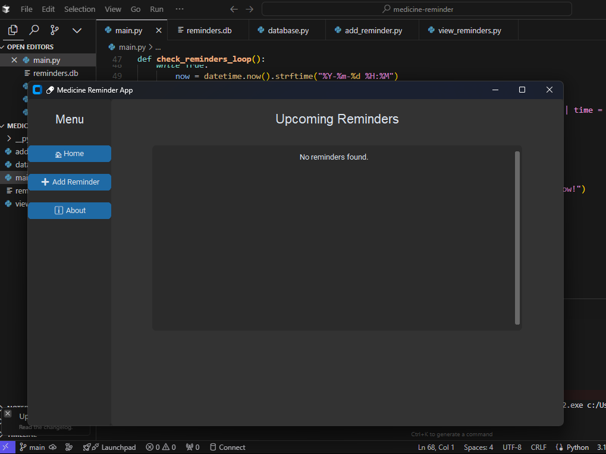

# Medicine Reminder App

[](https://www.python.org/)
[](LICENSE)
[](https://github.com/AshleyMathias/medicine-reminder/issues)
[](https://github.com/AshleyMathias/medicine-reminder/graphs/contributors)

---



----

A desktop application built with Python to help users manage medicine reminders efficiently. The app allows users to add, view, delete, and export medication schedules, with alert notifications and theme toggling for improved user experience.

---

## Features

- Add medicine reminders including patient name, medicine name, dosage, date, and time.
- View upcoming reminders in a scrollable list.
- Delete existing reminders.
- Receive pop-up notifications when it's time to take medicine.
- Export reminders to PDF for sharing or offline use.
- Switch between light and dark modes for UI comfort.

---

## Technology Stack

- **Programming Language:** Python 3.x  
- **GUI Framework:** CustomTkinter  
- **Date Picker:** tkcalendar  
- **Database:** SQLite3  
- **PDF Generation:** ReportLab  

---

## Installation

1. Clone the repository:

   ```bash
   git clone https://github.com/yourusername/medicine-reminder-app.git
   cd medicine-reminder-app
   ```
2. Create and activate a virtual environment (optional but recommended):

   python -m venv venv
   source venv/bin/activate  # On Windows use `venv\Scripts\activate`

3. Install dependencies:

   pip install -r requirements.txt

4. Run the application:
   main.py

---

### File Structure

medicine_reminder_app/
├── main.py             # Main application entry and navigation
├── add_reminder.py     # UI for adding reminders
├── view_reminders.py   # UI for viewing, deleting, and exporting reminders
├── database.py         # Database connection and queries
├── reminders.db        # SQLite database file (auto-created)
├── requirements.txt    # Python dependencies
├── README.md           # Project documentation

---

### Usage:
- Launch the app using python main.py.
- Use the Add Reminder page to input new medication reminders.
- View, delete, or export your reminders on the View Reminders page.
- Toggle between light and dark themes using the theme switcher.

---

### 🙋‍♀️ About the Developer
- Ashley Mathias: 
- Python Developer & AI Enthusiast
- Linkedin: ashleymathias10, Github: Ashley Mathias

---

<p align="center">
  Built with 💻 and ☕ by <strong>Ashley Mathias</strong>
</p>


